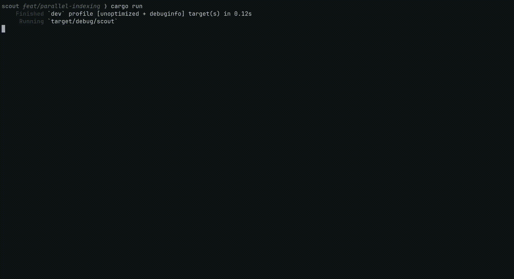

# Scout

A local file search engine, written in Rust. Scout indexes files from directories you
configure, tokenizes their content, and stores an inverted index in an embedded database —
searchable from a terminal UI via title-prefix match, file-name-token match, and BM-25
ranking. Indexing is event-driven: a background thread watches the filesystem and reindexes
only when something actually changes, so the index stays current without polling.



## Features

- **Full-text search** over indexed files, ranked with BM-25.
- **File-name search** that also matches binaries and images (which have no extractable
  content), via a separate name-token index.
- **Prefix search** on file names for fast, unranked lookups.
- **`.gitignore`-aware indexing** — a project's own ignore rules are respected automatically.
- **Live reindexing** on filesystem changes and on config changes, no restart required.
- **A TUI** (via `ratatui`) with search, results, a config screen for managing indexed
  directories, and an errors screen for diagnosing indexing failures.

## Install

Prebuilt binaries for Linux, macOS, and Windows are attached to every
[release](https://github.com/david-galdamez/scout/releases/latest). Pick the archive that
matches your OS and CPU architecture:

| OS      | Architecture   | Asset                                        |
| ------- | -------------- | --------------------------------------------- |
| Linux   | x86_64         | `scout-<version>-x86_64-unknown-linux-musl.tar.gz`  |
| Linux   | ARM64          | `scout-<version>-aarch64-unknown-linux-musl.tar.gz` |
| macOS   | Apple Silicon  | `scout-<version>-aarch64-apple-darwin.tar.gz`       |
| macOS   | Intel          | `scout-<version>-x86_64-apple-darwin.tar.gz`        |
| Windows | x86_64         | `scout-<version>-x86_64-pc-windows-msvc.zip`        |

(Not sure which architecture? `uname -m` on Linux/macOS: `x86_64` or `arm64`/`aarch64`. On
Windows, x86_64 covers the overwhelming majority of machines.)

The Linux binaries are statically linked against musl, so they run on any distro without
needing a matching glibc version.

### Linux / macOS

```sh
tar -xzf scout-<version>-<target>.tar.gz
chmod +x scout
sudo mv scout /usr/local/bin/   # or anywhere else on your $PATH
```

On macOS, since the binary isn't notarized by Apple, the first launch will be blocked by
Gatekeeper ("cannot be opened because the developer cannot be verified"). Either right-click
the binary and choose **Open** once, or clear the quarantine flag from the terminal:

```sh
xattr -d com.apple.quarantine scout
```

### Windows

Extract the `.zip`, then run `scout.exe` — either from the extracted folder, or after moving
it somewhere on your `PATH` (e.g. `%LOCALAPPDATA%\Programs\scout\`, added to `PATH` via
*Edit environment variables*). Windows SmartScreen will likely flag the first run since the
binary isn't code-signed; click **More info → Run anyway** to proceed.

### Verifying a download (optional)

Every archive has a matching `.sha256` file in the release. To verify:

```sh
sha256sum -c scout-<version>-<target>.tar.gz.sha256   # Linux/macOS
```

## Build from source

```sh
cargo build          # build
cargo run             # run the TUI
cargo test            # run the test suite
cargo clippy          # lint
cargo fmt             # format
```

On first run, Scout writes a default config to `~/.scout.toml` (indexing `~/Documents`,
excluding common noise directories like `node_modules`, `.git`, `target`) and creates its
database under the OS data directory. Both `include`/`exclude` directories are editable from
the config screen (`F1`) inside the app.

## Design

Scout is built as a straight-line pipeline, wired together in `src/main.rs`:

```
config → database → background indexing thread (watches filesystem, reindexes) → TUI
                                                                                     |
                                                                          search hits the database directly
```

A few decisions shaped that pipeline:

**An embedded database over a heavier search engine.** Scout uses [`sled`](https://github.com/spacejam/sled),
an embedded transactional key-value store, with a handful of trees forming a hand-rolled
inverted index (`terms`, `name_terms`, plus reverse-lookup trees so a document's stale
postings can be found and removed on reindex). Every write that touches multiple trees goes
through a single sled transaction, so a document is indexed atomically or not at all — no
external service to run, no partial-write states to reason about.

**Files are identified by platform ID, not by path.** Every indexed file is tracked primarily
by its `(device, inode)` pair on Unix (or the Windows equivalent), with path as a fallback for
platforms/filesystems that can't provide one. That's what lets a rename be recognized as a
rename — reindexing the same document in place — instead of looking like a delete plus a
brand-new file.

**BM-25 for ranking, prefix match for speed.** A search first tries a fast prefix match against
file names; if nothing matches, it falls back to BM-25-ranked results from content terms, with
file-name-token matches (which also surface binaries and images) appended after.

## Problems along the way

Two things stood out during development as worth solving properly rather than living with:

### Sequential directory walking

The original walker traversed directories one at a time with `walkdir`, and had no concept of
`.gitignore` — everything under an included directory got indexed, dependency directories and
build artifacts included, unless manually excluded by name in Scout's own config.

Both problems were solved by switching to the [`ignore`](https://docs.rs/ignore) crate — the
same walking engine behind `ripgrep` and `fd`. It provides `WalkParallel`, which spreads
traversal, classification, and indexing across a thread pool sized to the machine's core count,
and it understands `.gitignore`/`.ignore` files natively, so a project's own ignore rules prune
`node_modules`, `target`, `.git`, and friends automatically as the walk descends into it —
without Scout needing to special-case any of them.

The tradeoff was coordination: multiple worker threads now write concurrently into shared
state (the set of visited file IDs, the list of per-file errors, and the database's own
aggregate stats). That's handled with `Mutex`-guarded shared state during the walk, and sled's
own transaction retries on write conflicts — correctness holds, at the cost of a serialization
point on the final commit step under high concurrency. See the notes in `CLAUDE.md` for where
that could be optimized further if it ever shows up as a real bottleneck.

### Reindexing on a stale timer

Early versions reindexed everything on a flat 5-minute timer, regardless of whether anything
had actually changed — wasted work on an idle filesystem, and up to 5 minutes of staleness
after a real change.

That was replaced with filesystem-event-driven reindexing, built on `notify`. It's not quite as
simple as "watch a directory and reindex on any event," for two reasons:

- **Watches have to mirror what's actually indexed.** A single recursive watch per included
  root would register far more OS-level watches than are actually needed (risking a platform
  watch-count limit) for directories that are gitignored/excluded and were never going to be
  indexed anyway. Instead, Scout enumerates every directory that would survive the same
  filtering the walker applies, and registers one non-recursive watch per directory — so the
  watch set and the indexed set can't drift apart.
- **The watcher sees its own reads as writes.** On Linux, `notify`'s inotify backend hardcodes
  a watch on file *opens*, with no way to turn it off — so Scout reading a file to index it
  fires a filesystem event, which would trigger another reindex, which reads the file again,
  forever. The fix was filtering out access events before they reach the debounce logic, and
  hand-rolling the debounce itself (rather than pulling in a debounce crate), since neither of
  the available debounce crates filters by event kind before treating something as a real
  change — pulling one in as-is would have reintroduced the same loop.

The result: a background thread that reindexes once at startup, then blocks until either a
real filesystem change settles (debounced by 2 seconds) or the config is saved with a changed
`include`/`exclude` list — keeping the index current without polling or wasted work.

## Architecture

For the full pipeline breakdown — every module, database tree, and the reasoning behind each
one — see [`CLAUDE.md`](CLAUDE.md), which doubles as the project's living design doc.

## License

MIT — see [`LICENSE`](LICENSE).
